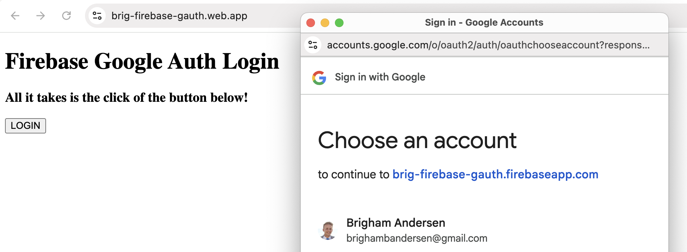

# firebase-gauth

I've always wanted to see how to set up Google Sign-In, so this was just a little proof of concept of using Firebase to sign in with Google to a basic HTML site.

See [site](https://brig-firebase-gauth.web.app/) for full example, but here's a screenshot:

